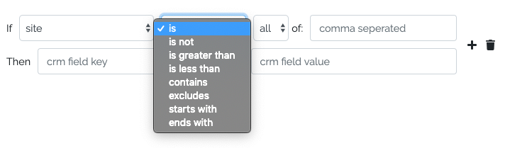

# Value Comparison
Compare value to another value in order to perform advanced logic on user input (comparisons such as greater than, starts with, contains and with any or all to compare against multiple)

# Why Value Comparison Library?
Value comparison is simple, why have a library for it? My use case is to take an operator from user input (an html select field), so:
1. Having the operators in word format solved 2 issues: 
   * can't have dynamic operators
   * provides non-coder friendly terminology
2. Having the ability to pass "any" or "all" (once again from user input comma separated seemed a no-brainer)
3. Full test coverage for confidence that it'll works every time 
4. This makes ValueComparison a library perfectly fit to handle the input of a user interface like this:


# Examples
```
use DanielKellyIO\ValueComparison\Compare;

// Check if string contains another string
Compare::value('Value to test')->contains('test'); // true

//Check if string contains ANY other strings (pass an array or string with values comma seperated)
Compare::value('Value to test')->contains('test, not, there', 'any'); // true
//or
Compare::value('Value to test')->contains(['test', 'not', 'there'], 'any'); // true

//Check if string contains ALL other strings (pass an array or string with values comma seperated)
Compare::value('Value to test')->contains('test, not, there', 'all'); // false
//or
Compare::value('Value to test')->contains(['test', 'not', 'there'], 'all'); // false
```

# Methods
* __is__ - check if value is exact match to comparison value (coerced to string)
* __isNot__ - check if value is NOT an exact match to comparison value (coerced to string)
* __greaterThan__ - check if value is greater than comparison value (coerced to integer)
* __lessThan__ - check if value is less than comparison value (coerced to integer)
* __contains__ - check if value is contains comparison value (coerced to string)
* __excludes__ - check if value is excludes comparison value (coerced to string)
* __startsWith__ - check if value is starts with comparison value (coerced to string)
* __endsWith__ - check if value is ends with comparison value (coerced to string)

# Scopes
* __null__ - treats comparison value as a single entity to compare against value 
* __any__ - value only has to match one of the comparison values (comparison value can be array or comma seperated string)
* __all__ - value has to match ALL of the comparison values (comparison value can be array or comma seperated string)
